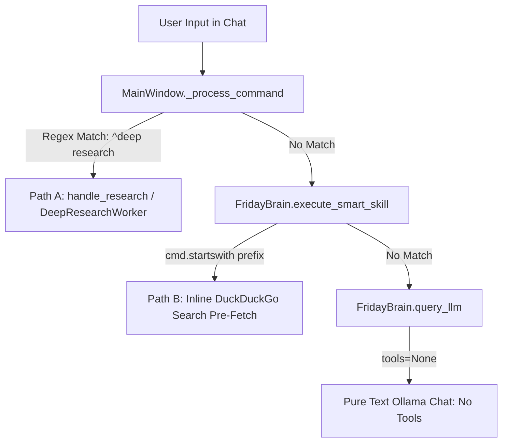

# F.R.I.D.A.Y. 3.0 — Legacy Router & Keyword Path Analysis

---

### 1. Overview of Existing Web Trigger Mechanisms

Prior to native agent tool plumbing, F.R.I.D.A.Y. relied on two distinct **manual / keyword-intercept paths** in Python to activate web capabilities. Neither of these paths is agentic; both operate strictly on regex string pattern matching.



---

### 2. Path A: Dedicated Deep Web Research (`handle_research`)

- **Trigger Location**: [`friday_ui/views/main_window.py:601-609`](file:///c:/Users/Admin/OneDrive/Documents/jarvis%20voice/friday_ui/views/main_window.py#L601-L609)
- **Regex Pattern**:
  ```python
  re.search(r"^(?:do\s+(?:a\s+)?)?deep\s+(?:web\s+)?research\s+(?:on|about|web\s+and\s+tell\s+about|web\s+about)?\s*(.+)$", command, re.IGNORECASE)
  ```
- **Alternate Trigger**: The `+` Deep Research toggle button in [`ChatView`](file:///c:/Users/Admin/OneDrive/Documents/jarvis%20voice/friday_ui/views/chat_view.py).
- **Execution Mechanism**:
  - Instantiates `DeepResearchWorker(QThread)`.
  - Runs multi-vector decomposition, top-5 deep page content extraction, claim cross-checking, and neural dossier synthesis.
  - Updates `ResearchView` and `ChatView` asynchronously.
- **Why It Does Not Catch `"who is jensen huang search web and tell"`**:
  - The sentence begins with `"who is"` rather than `"deep research"`.
  - The query bypasses Path A entirely.

---

### 3. Path B: Legacy Prefix Matching in `execute_smart_skill`

- **Trigger Location**: [`friday_ui/core/engine.py:3656-3720`](file:///c:/Users/Admin/OneDrive/Documents/jarvis%20voice/friday_ui/core/engine.py#L3656-L3720)
- **Prefix List**:
  ```python
  search_prefixes = [
      "search the web and ", "search the web for ", "search the web about ", "search the web to ", "search the web ",
      "search web and ", "search web for ", "search web about ", "search web ",
      "search online for ", "search online about ", "search internet for ", "search internet about ",
      "search the internet for ", "search the internet about ",
      "research the web for ", "research online for ", "research the web about ", "research about ", "research ",
      "search for ", "search about ", "search ",
      "google for ", "google search for ", "google ",
      "duckduckgo for ", "duckduckgo ",
      "web search for ", "web search about ", "web search ",
      "look up ", "browse for ", "browse the web for ", "find out about ",
      "what are the latest ", "what is the latest ", "what's the latest ",
      "tell me the latest ", "tell me about latest ", "tell me about the latest ",
      "latest news on ", "latest news about ", "recent updates on ", "recent news about "
  ]
  ```
- **Matching Rule**:
  ```python
  for prefix in search_prefixes:
      if cmd.startswith(prefix):
          ...
  ```
- **Why It Failed for `"who is jensen huang search web and tell"`**:
  - Evaluates `cmd.startswith(prefix)`.
  - The phrase `"search web and tell"` is located at the *end* of the command.
  - The prefix matching returns `False` for all prefixes.
- **Why It Failed on Temporal Markers**:
  - Temporal markers require `as of 2026`, `in 2026`, `latest`, `recent`, `today`.
  - The query `"who is jensen huang search web and tell"` has none of these tokens.
  - Therefore, `execute_smart_skill` returned `None`, falling through to pure chat `query_llm()`.

---

### 4. Dependency & Regression Protection

The following existing features and regression tests rely on these legacy paths:
- `tests/regression/test_bug_001_chat_silence.py`
- `tests/test_deep_research_and_vision.py`
- Manual UI menu clicks on the `+` Deep Research button.

Per **Rule 11**, these legacy paths **MUST NOT** be deleted during this repair. They will remain intact as fast-path fallbacks, while the shared model-tool integration is added to `query_llm()` so that *any* query (with or without trigger keywords) can autonomously invoke tools.
