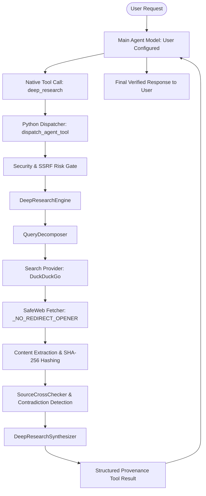

# F.R.I.D.A.Y. 3.0 — Deep Research Subsystem Architecture

## 1. Zero-Trust Pipeline Overview

## 2. Key Components & Responsibilities
- **Research Task Owner**: `friday_core.agent.task_lifecycle.task_supervisor` (`TaskRecord`)
- **Query Decomposition**: `friday_core.research.decomposer.QueryDecomposer` (cleans topic, generates up to 4 orthogonal facets)
- **Search Provider**: `friday_ui.core.engine.fetch_web_results` (DuckDuckGo HTML backend)
- **Web Fetch & SSRF Guard**: `friday_core.web.fetcher.is_safe_url`, `_NO_REDIRECT_OPENER` (blocks loopback, RFC 1918 private subnets, cloud metadata 169.254.169.254, non-HTTP schemes, redirects)
- **Content Extractor**: `fetch_page_content_detailed` (strips scripts/styles/nav/footers, enforces >=50 chars for `VERIFIED` status, computes SHA-256 content hash)
- **Cross-Checking & Contradictions**: `SourceCrossChecker` (corroborates claims across sources, raises confidence scores, detects opposing claims)
- **Synthesis Engine**: `DeepResearchSynthesizer` (structures findings, contradictions, and Markdown citations)
- **Background Worker**: `DeepResearchWorker` (QThread with real-time token/thinking streaming, watchdog heartbeats, and clean cooperative cancellation)
- **Model Resolution**: Dynamic from configuration (`qwen3.5:9b`), zero hard-coded models.
