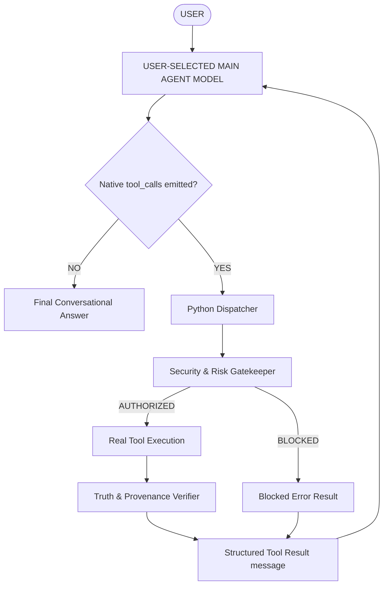

# F.R.I.D.A.Y. 3.0 — Model-Agnostic Native Tool-Calling Architecture

## Executive Architecture Summary
The production autonomous agent architecture enforces strict separation between model intent and Python execution:
- **Decision Authority**: ONLY the user-selected `MAIN_AGENT_MODEL` determines whether a tool is called, which tool is called, and with what parameters.
- **Python Role**: Exposes registered tool schemas, runs security/risk verification gates, executes functions, verifies outputs, and returns structured tool results to the **SAME** `MAIN_AGENT_MODEL`.
- **Zero Python Interception**: No keyword routing (`if "search" in msg`), no intent classifiers selecting tools, no hidden 1B preflight routers.

## Tool Decision Matrix

| Tool | Visible to MAIN MODEL | MAIN MODEL can request | Python selects? | Executed | Result returned to SAME MODEL | Verified |
|------|------------------------|------------------------|-----------------|----------|-------------------------------|----------|
| web_search | YES | YES | NO | YES | YES | YES |
| deep_research | YES | YES | NO | YES | YES | YES |
| web_fetch | YES | YES | NO | YES | YES | YES |
| launch_app | YES | YES | NO | YES | YES | YES |
| inspect_ui | YES | YES | NO | YES | YES | YES |
| click_control | YES | YES | NO | YES | YES | YES |
| type_text | YES | YES | NO | YES | YES | YES |
| analyze_image | YES | YES | NO | YES | YES | YES |
| read_document | YES | YES | NO | YES | YES | YES |
| timer | YES | YES | NO | YES | YES | YES |
| weather | YES | YES | NO | YES | YES | YES |
| calculate | YES | YES | NO | YES | YES | YES |
| system_telemetry | YES | YES | NO | YES | YES | YES |
| system_time_date | YES | YES | NO | YES | YES | YES |

All tools maintain `Python selects? = NO`.
