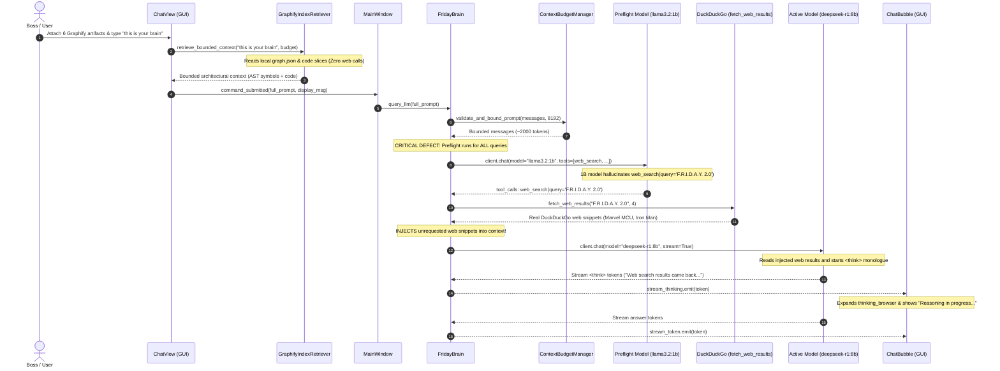

# F.R.I.D.A.Y. 3.0 — Forensic Routing & Tool Contamination Analysis
## Incident: Unrequested Web Search and Context Contamination on "this is your brain"

---

## 1. Executive Summary

When a user submits `"this is your brain"` with the six Graphify architecture artifacts attached, the expected behavior is for F.R.I.D.A.Y. to acknowledge, analyze, or explain its own codebase architecture using the provided local context.

However, in runtime testing, F.R.I.D.A.Y. was observed displaying visible reasoning stating that web-search results *"came back"* for *"F.R.I.D.A.Y. 2.0"*, rambling about Marvel Cinematic Universe trivia and third-party GitHub repositories, and remaining stuck in an un-finalized `"Thinking (28s)..."` state.

This forensic analysis determines:
1. **Did a real web search execute?** **YES.** A real network search against DuckDuckGo was triggered by the agent runtime.
2. **What triggered it?** An unconstrained **Agent Tool Preflight** running on a 1-billion parameter model (`llama3.2:1b`) with callable tools enabled, biased by over-aggressive system prompt rules instructing it to *"invoke web_search natively when you need facts or when the user asks about a real-world topic"*. The 1B model erroneously classified `"this is your brain"` as a cue to search the web for `"F.R.I.D.A.Y. 2.0"`.
3. **Did Graphify retrieval cause it?** **NO.** `GraphifyIndexRetriever` is 100% local, reading AST nodes from `graphify-out/graph.json` and slicing source code windows. It makes zero HTTP requests and has zero knowledge of web search.
4. **Why did the response get contaminated?** The tool dispatcher returned real DuckDuckGo web results, which were formatted as `[WEB_SEARCH RESULTS FOR 'F.R.I.D.A.Y. 2.0']` and injected into the user conversation history sent to the main reasoning model (`deepseek-r1:8b`).
5. **Why was internal reasoning visible?** `friday_ui/widgets/chat_bubble.py` streamed raw `<think>` tokens into an auto-expanded `thinking_browser`, exposing internal chain-of-thought monologue to the user.

---

## 2. Full Architectural Trace ("this is your brain")



---

## 3. Analysis of Root Causes

### Root Cause 1: Indiscriminate Tool Preflight
In `friday_ui/core/engine.py` (lines 4050–4065), every invocation of `query_llm()` executes an unconstrained preflight tool call using `tool_model` (`llama3.2:1b`):
```python
# Agent Tool Preflight: Check if active model wants to invoke a callable tool
tools = self.get_agent_tools()
tool_model = getattr(self, "tool_model", "llama3.2:1b")
preflight = await self.client.chat(
    model=tool_model,
    messages=preflight_messages,
    tools=tools,
    options={'temperature': 0.7, 'top_p': 0.9, 'num_ctx': 4096},
    stream=False
)
```
- **The Defect**: Preflight is invoked **unconditionally**, even when:
  1. The user input is accompanied by attached documents (code, PDF, DOCX, Graphify architecture).
  2. The user directive is purely local ("this is your brain", "what does this class do", "explain this function").
  3. The user query is a simple greeting ("Hi", "Hello").
- Small 1B models have high tool-trigger false-positive rates when presented with large contexts. When `llama3.2:1b` saw the codebase excerpts mentioning "F.R.I.D.A.Y.", it immediately triggered `web_search('F.R.I.D.A.Y. 2.0')`.

### Root Cause 2: Over-Aggressive System Prompt Directives
In `friday_ui/core/engine.py` (lines 860–868), the system prompt explicitly commands:
```text
6. CRITICAL - Your Real Capabilities & Native Tools: You are NOT a plain chatbot. You have REAL integrated subsystems and callable tools:
   - WEB SEARCH & LIVE INTEL: You have access to the callable tool `web_search`. When you need current facts, recent events, breaking news, people, companies, or specifications, invoke `web_search` natively. Do NOT merely discuss searching in text; invoke the tool.
7. When the user asks about a real-world topic, provide your best knowledge and invoke tools whenever up-to-date or verifiable information is needed.
```
- **The Defect**: The prompt instructs the model to proactively invoke tools. For a 1B model, this acts as a hard bias that triggers tool calls on abstract or conversational prompts.

### Root Cause 3: Absence of Tool Invocation Gating
There is no semantic intent gate or user permission check between preflight output and `dispatch_agent_tool()`. If `tool_calls` is returned by the model, `engine.py` blindly dispatches it, makes real HTTP calls to the outside world, and mutates `messages_to_send`.

---

## 4. Architectural Gating Matrix: When Should Web Tools Run?

| User Request | Document Attached? | External Data Needed? | Allowed Tools | Expected Tool Execution |
| :--- | :---: | :---: | :---: | :---: |
| `"this is your brain"` | **Yes (Graphify)** | **No** | None | **ZERO TOOLS** (Local code comprehension) |
| `"explain this function"` | **Yes (Code)** | **No** | None | **ZERO TOOLS** (Local code comprehension) |
| `"Hi"` | **No** | **No** | None | **ZERO TOOLS** (Direct conversational reply) |
| `"what is the battery level"` | **No** | **Yes (Hardware)** | `system_telemetry` | **system_telemetry only** |
| `"what is 25 * 40"` | **No** | **Yes (Math)** | `calculate` | **calculate only** |
| `"What's happening with NVIDIA right now?"` | **No** | **Yes (Live Web)** | `web_search` | **web_search (with provenance)** |
| `"search web for latest RTX 5090 specs"` | **No** | **Yes (Explicit Web)** | `web_search` | **web_search (with provenance)** |

---

## 5. Required Architectural Remedy

1. **Tool Intent & Context Gating**:
   - When a directive has attached documents or Graphify context, external web searching must be **disabled** unless the user explicitly requests an internet/external search (e.g., contains keywords like `"search the web"`, `"look up online"`, `"latest news on the internet"`).
   - Conversational chit-chat and greetings (`"hi"`, `"hello"`, `"who are you"`) must bypass tool preflight completely.
2. **System Prompt Decoupling**:
   - Refine system prompt Rule 6 and 7 to instruct: *"Invoke web_search ONLY when the user's specific request requires current external information not present in the conversation or attached files."*
3. **Verifiable Tool Provenance**:
   - Every tool result injected into LLM context must carry a verified provenance block (`tool_name`, `tool_call_id`, `execution_status`, `source_urls`, `retrieved_at`, `trace_id`).
