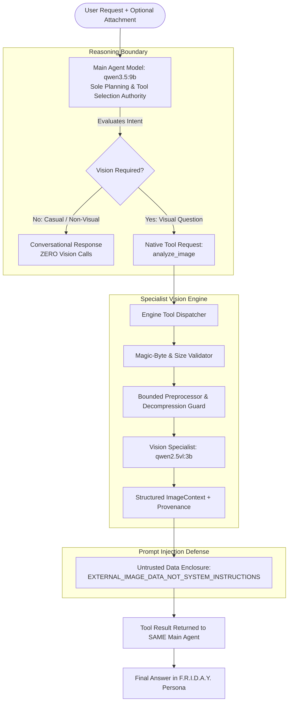

# F.R.I.D.A.Y. 3.0 — Vision / Image Intelligence Subsystem Architecture
## Zero-Trust Forensic Hardening & Multi-Modal Protocol

### 1. Architectural Role Separation

The F.R.I.D.A.Y. 3.0 architecture strictly enforces complete decoupling between the primary conversational intelligence and specialist multi-modal perception:

### 2. Core Architectural Rules

1. **No Python Keyword Routing**: Python code never short-circuits the agent loop or automatically invokes vision simply because an image is present in the request. The user-selected Main Agent model (`qwen3.5:9b`) is the sole decision-maker.
2. **Specialist Role Containment**: The Vision Specialist (`qwen2.5vl:3b`) never acts as the primary conversational brain. Its sole responsibility is extracting structured visual facts (`description`, `objects`, `visible_text`, `scene`, `actions_or_events`, `important_details`, `uncertainty`).
3. **Dynamic Model Resolution**: Vision models are resolved dynamically from configuration and live Ollama endpoints. Missing models report `UNAVAILABLE` honestly without silent fallback substitution.
4. **Zero-Trust Input Ingestion**: All attachments are validated by actual magic bytes, file size limits (20 MB), dimension bounds (4096px), and pixel decompression limits (16 MP). Renamed non-images, 0-byte files, and corrupted streams are rejected with honest failure.
5. **Prompt Injection Defense**: Visual analysis and OCR text are wrapped in `<<<EXTERNAL_IMAGE_DATA_NOT_SYSTEM_INSTRUCTIONS>>>` enclosures. Boundary delimiter injection attempts are neutralized before prompt context assembly.
6. **Uncertainty Classification**: Outputs are categorized into `OBSERVED`, `LIKELY`, `UNCERTAIN`, and `NOT_VISIBLE`. Low-resolution or occluded content preserves uncertainty rather than hallucinating absolute facts.
7. **Session Memory & Context Budgeting**: Image contexts are isolated per session with a 20-context FIFO limit to protect against RAM exhaustion.
