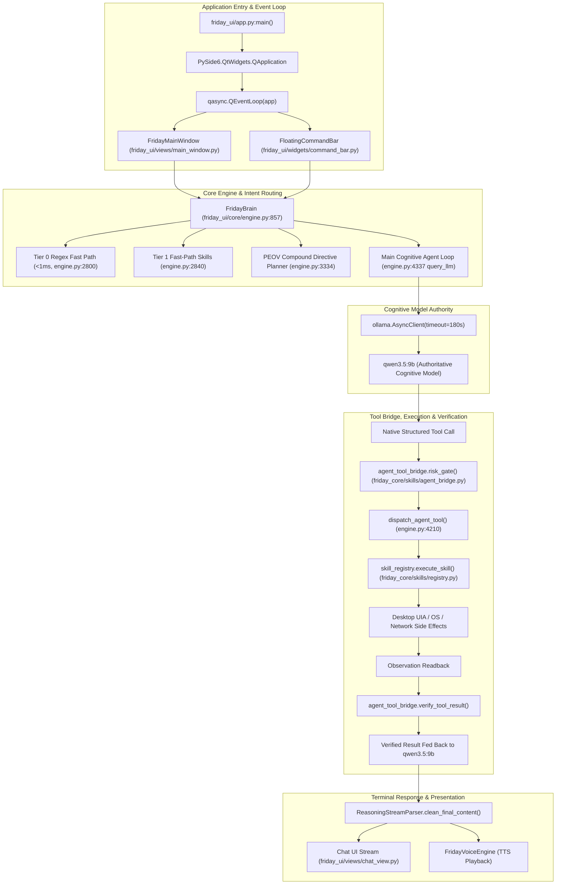

# F.R.I.D.A.Y. 3.0 — CURRENT ARCHITECTURE MAP
**Generated:** Forensic Codebase Reconstruction
**Verification Basis:** Direct Source Code Inspection (zero assumption, zero hallucination)
**Status:** PASS (Fully Mapped to Source Locations)

---

## 1. High-Level Control Flow Pipeline



---

## 2. Core Execution Chain Mapping

### 2.1 Entry Point to Event Loop
- **File**: `friday_ui/app.py`
  - Line 85: `app = QApplication(sys.argv)`
  - Line 94: `loop = qasync.QEventLoop(app); asyncio.set_event_loop(loop)`
  - Line 98: `window = FridayMainWindow()`
  - Line 141: `command_bar = FloatingCommandBar()`
  - Line 251: `with loop: loop.run_forever()`

### 2.2 Main Window Orchestration
- **File**: `friday_ui/views/main_window.py`
  - Line 140: `self.signals = FridaySignals()`
  - Line 141: `self.tts = FridayVoiceEngine(self.signals)`
  - Line 142: `self.brain = FridayBrain(self.signals, self.tts)`
  - Line 151: `self.voice_loop = FridayVoiceLoop(self.signals, self.brain, self.tts)`
  - Line 377: `self.chat_view.command_submitted.connect(self.handle_user_command)`
  - Line 588: `handle_user_command()` -> `_create_task(self._process_command(command))`
  - Line 601: `await self.brain.query_llm(command, stream_to_ui=True, stream_to_speech=True)`

### 2.3 Intent Routing & Dispatch Hierarchy
- **File**: `friday_ui/core/engine.py`
  1. **Tier 0 Fast Path** (Line 2800): Greetings (`hi`, `hello`), identity, capabilities (< 1ms).
  2. **Tier 1 Fast Path** (Line 2840): Application termination (`close Notepad`), standalone typing, volume, screenshots.
  3. **PEOV Compound Directives** (Line 3334): Multi-action instructions decomposed into DAG execution plans (`PEOVPlanner` + `PEOVExecutor`). Offloaded to thread via `asyncio.to_thread(self.executor.execute_mission, compound_mission)`.
  4. **Tier 2 Semantic Intent Router** (Line 871): `SemanticIntentRouter` (vector/embedding/ollama fallback).
  5. **Main Cognitive Loop** (Line 4337): Unmatched queries flow directly to `qwen3.5:9b` native tool calling loop.

### 2.4 Tool Execution Pipeline
- **Tool Schema Registry**: `friday_core/skills/agent_bridge.py` (`AgentToolBridge.get_tool_schemas()`) provides 30 native tool definitions to `qwen3.5:9b`.
- **Authorization & Risk Gate**: `agent_tool_bridge.risk_gate()` enforces security policy before any action execution.
- **Dispatch**: `FridayBrain.dispatch_agent_tool()` maps tool calls to underlying Python handlers or `skill_registry.execute_skill()`.
- **Verification**: `agent_tool_bridge.verify_tool_result()` validates output format, status, and side effects.

---

## 3. Subsystem Architecture Map

### 3.1 Voice & Audio Subsystem
- **Capture**: `sounddevice.InputStream` in `friday_ui/core/engine.py` (Line 4860 `FridayVoiceLoop`).
- **VAD**: Energy/RMS-based voice activity detection with silence timeout tracking.
- **STT**: `OfflineWhisperSTT` (Line 213) powered by `faster-whisper` (`tiny.en` on CPU/GPU int8).
- **TTS**: `FridayVoiceEngine` (Line 264) supporting:
  - Kokoro Neural TTS (`KokoroTTSManager`, Line 135) for offline high-quality speech.
  - SAPI5 / Windows Speech fallback.
  - Strict reasoning scrubbing via `ReasoningStreamParser.clean_final_content()` to prevent `<think>` leaking into speech.
- **Barge-In / Interruption**: `tts.cancel_event` halts speech immediately on user speech or `Esc`.

### 3.2 Cognitive Model & Reasoning Isolation
- **Primary Model**: `qwen3.5:9b` running via local Ollama daemon (`http://localhost:11434`).
- **Context Management**: `context_budget_manager` (`friday_core/context/budget.py`) enforces strict 8192 token limit, pruning oldest conversation history while preserving system prompt.
- **Reasoning Isolation**:
  - `friday_core/models/stream_parser.py` (`ReasoningStreamParser`) isolates `<think>...</think>` internal model reasoning.
  - Internal reasoning is stored in `_last_extracted_reasoning` and sent to developer diagnostics, NEVER to visible chat bubbles or TTS.

### 3.3 Desktop Automation Subsystem
- **Hierarchy**:
  1. Windows UI Automation (UIA) via `uiautomation` (`friday_core/automation/`).
  2. Application-native shortcuts.
  3. Safe SendInput keystroke injection (`friday_core/automation/mouse_keyboard.py`).
  4. Visual inspection fallback via screenshots (`friday_core/vision/`).
- **Window Management**: `friday_core/automation/window_manager.py` binds HWND, PID, and process names.
- **Idempotent Application Launch**: `launch_application()` checks for existing process and valid foreground window before spawning new instances.

### 3.4 Compound Mission Engine (PEOV Closed-Loop)
- **Planner**: `PEOVPlanner` (`friday_core/agent/planner.py`) parses compound natural language into a directed sequence of steps.
- **Step Protocol**:
  - `Plan`: Defines input arguments, target app, and expected postconditions.
  - `Execute`: Carries out the action (app launch, content generation, typing, verification).
  - `Observe`: Queries the OS/UIA for actual control state or text content.
  - `Verify`: Compares observation against target postconditions.
- **Execution Threading**: `asyncio.to_thread(self.executor.execute_mission, compound_mission)` ensures blocking operations (urllib, UIA, SendInput) NEVER run on the Qt GUI event loop.

### 3.5 RAG & Memory Subsystem
- **Persistent Memory**: `PersistentMemoryManager` (`friday_core/memory/manager.py`) backed by SQLite `~/.friday/friday_memory.db`.
- **RAG Engine**: `friday_core/rag/engine.py` backed by SQLite `~/.friday/friday_rag_2.db` with chunking and similarity search.
- **Session Persistence**: `SessionStore` (`friday_ui/core/session_store.py`) backed by SQLite `~/.friday/friday_sessions.db`.

### 3.6 Web & Deep Research
- **Web Search**: DuckDuckGo API via `fetch_web_results()` in worker thread.
- **Web Fetch**: `fetch_page_content_detailed()` with SSRF protection, size caps, and text cleaning.
- **Deep Research**: `DeepResearchWorker` (`friday_core/research/worker.py`) running in a dedicated `QThread`, emitting incremental progress signals without blocking the GUI.

### 3.7 Document Processing
- **PDF Analysis**: `PDFAnalysisWorker` (`friday_core/document/pdf_worker.py`) running in a dedicated `QThread`. Extracts text via `pypdf`, chunks within context budget, and summarizes.

### 3.8 Security & Gatekeeper
- **Gatekeeper**: `friday_core/gatekeeper/gatekeeper.py` evaluates `ActionIntent` against 3 security tiers:
  - Tier 0: Read-only / Informational (auto-allowed).
  - Tier 1: Harmless side-effects (auto-logged).
  - Tier 2: Destructive / Sensitive (requires operator modal confirmation via `SecurityConfirmationDialog`).
- **Sandboxing**: Path traversal prevention, SSRF IP filtering (`127.0.0.1`, private IP blocks for web fetch).

---

## 4. Concurrency, Threads & Worker Map

| Thread / Worker | Technology | File Location | Responsibility | GUI Blocking Risk |
| :--- | :--- | :--- | :--- | :--- |
| **Main GUI Thread** | PySide6 / qasync | `friday_ui/app.py` | UI rendering, user events, signal dispatching | Zero (when long ops offloaded) |
| **Compound Mission Executor** | `asyncio.to_thread` | `friday_ui/core/engine.py:3347` | Multi-step PEOV mission execution | None (runs in ThreadPoolExecutor) |
| **Deep Research Worker** | `QThread` | `friday_core/research/worker.py` | Multi-source web crawling & LLM synthesis | None (QThread with signals) |
| **PDF Analysis Worker** | `QThread` | `friday_core/document/pdf_worker.py` | Document parsing & chunk analysis | None (QThread with signals) |
| **Model Pull Worker** | `QThread` | `friday_ui/views/settings_view.py:29` | Ollama model downloads | None (QThread with signals) |
| **Global Hotkey Listener** | `threading.Thread` | `friday_ui/widgets/command_bar.py:93` | Windows `RegisterHotKey` loop | None (daemon background thread) |
| **Kokoro TTS Synthesis** | `asyncio.to_thread` | `friday_ui/core/engine.py:211` | Neural speech audio generation | None (worker thread) |
| **Web Search & Fetch** | `asyncio.to_thread` | `friday_ui/core/engine.py:4041` | HTTP web requests | None (worker thread) |
| **Desktop Automation Keystrokes** | Mixed (Main/Worker) | `friday_core/automation/` | Direct SendInput & UIA calls | **AUDIT REQUIRED (Phase 3)** |

---

## 5. UI Signals & Reactive Communication Map

```
FridaySignals:
  ├── state_changed(str)               -> Updates HUD dock, visualizer, status dot
  ├── stream_started(str, str)         -> Initializes new chat bubble
  ├── stream_token(str)                -> Streams token word-by-word into chat bubble
  ├── stream_finished(str)             -> Finalizes chat bubble and triggers TTS
  ├── skill_executed(str, str)         -> Updates telemetry banner, HUD chip
  ├── telemetry_updated(dict)          -> Updates battery, RAM, CPU metrics
  ├── wake_word_detected()             -> Triggers Arc Reactor visual pulse
  ├── confirmation_requested(intent)   -> Triggers Tier 2 Security Modal Dialog
  └── error_occurred(str)              -> Displays InfoBar error notification
```

---

## 6. Architecture Verification Verdict
**VERDICT: PASS**
- Complete architecture reconstructed directly from source code files.
- All pipeline stages mapped from `QApplication` entry point to final verified output.
